# YouTwo — screenshots

Captured from a live instance with `node worker/capture-previews.mjs <baseUrl>`.
Only demo content is shown.

## Web

| | |
|---|---|
| **Home feed** | 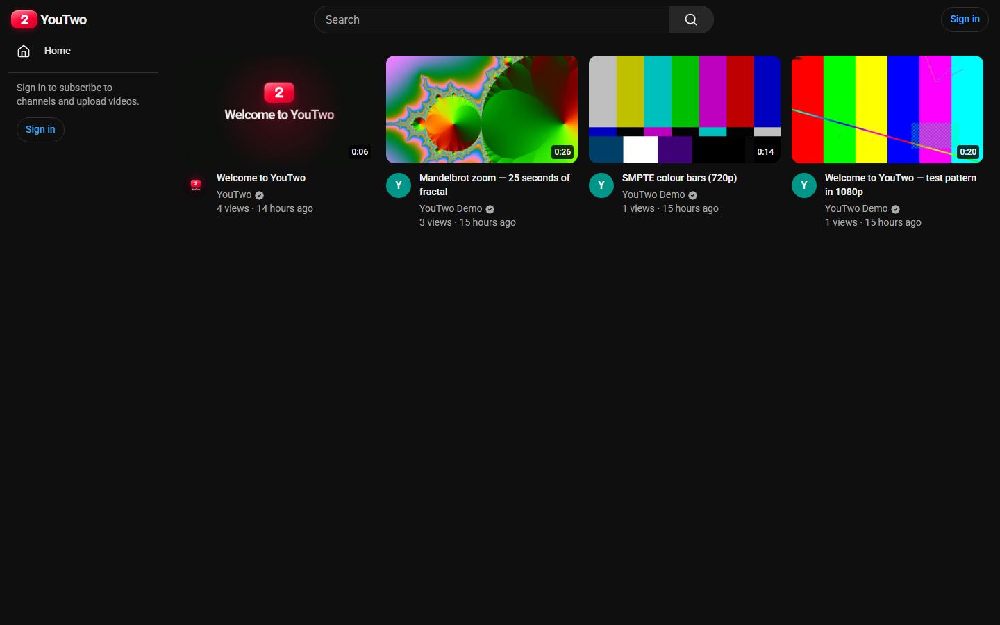 |
| **Watch page** — HLS playback, recommendations, likes, comments | 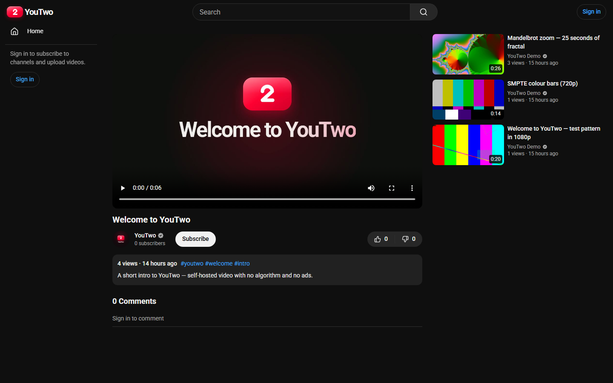 |
| **Channel page** — banner, avatar, verification, tabs | 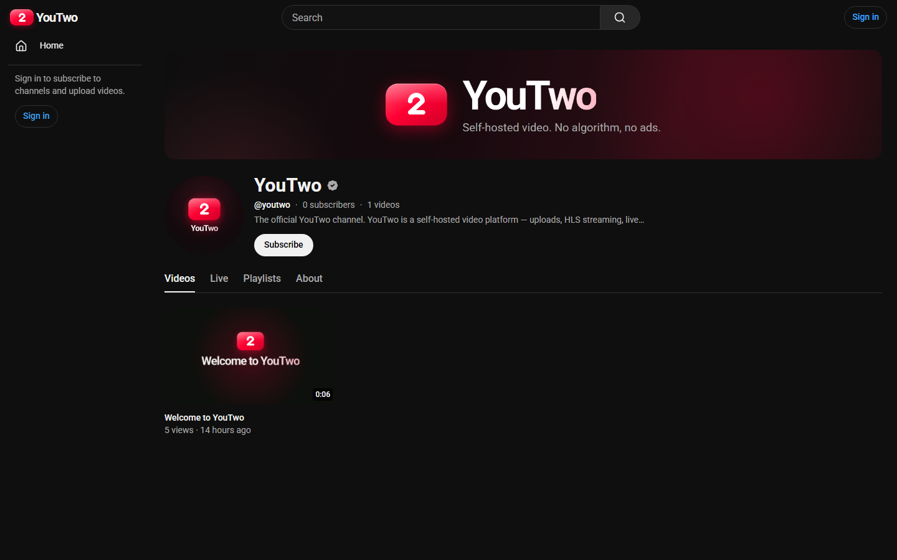 |
| **Search** — titles, tags, and channels | 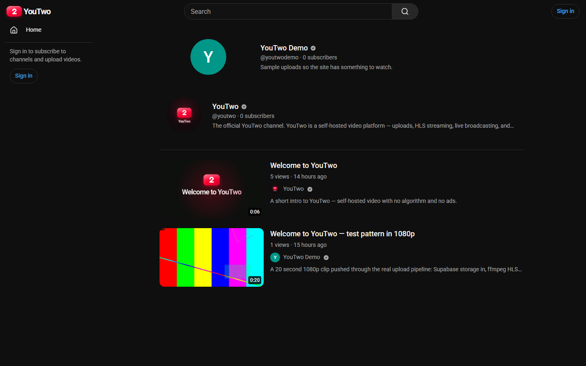 |
| **Sign in** | 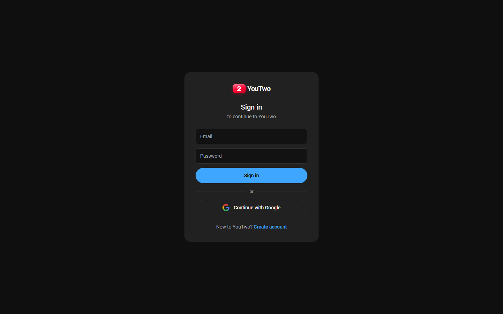 |

## YouTwo Studio

| | |
|---|---|
| **Dashboard** | 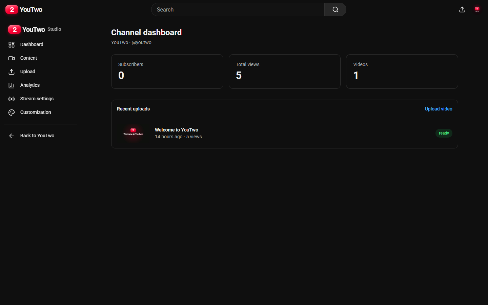 |
| **Content** — every upload with its processing state | 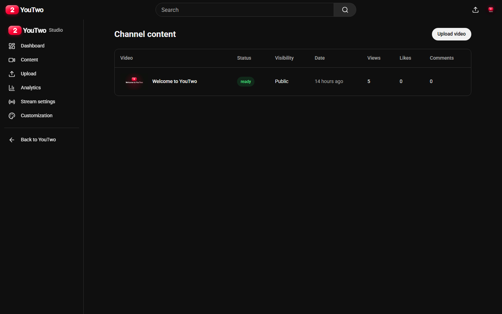 |
| **Upload** | 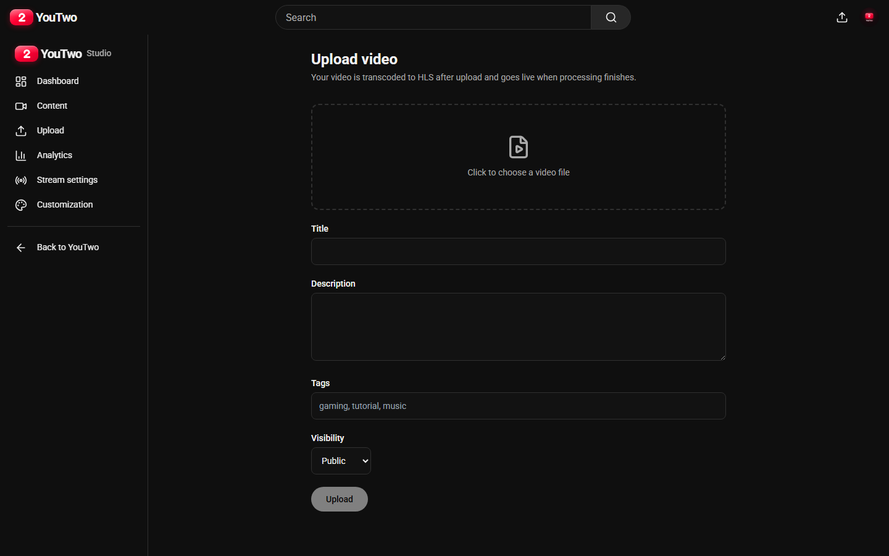 |
| **Analytics** | 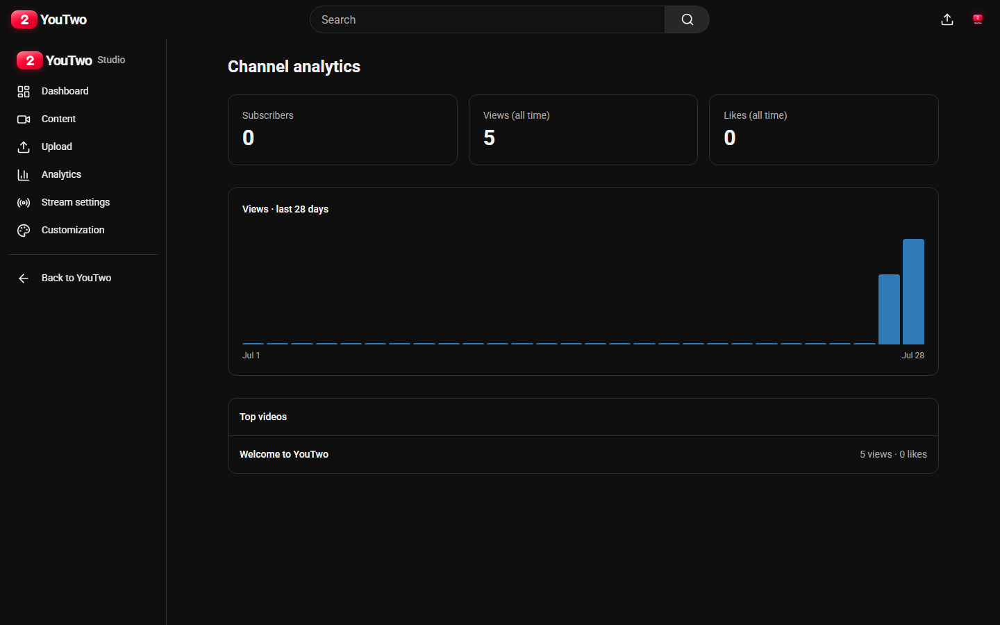 |
| **Stream settings** — RTMP ingest URL and stream key | 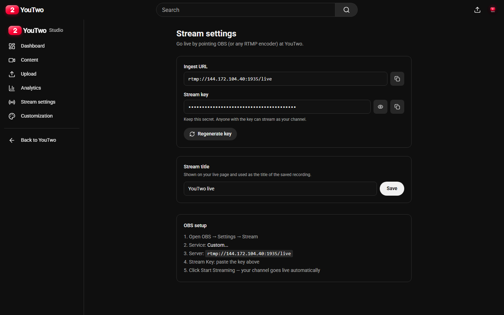 |
| **Customization** — banner, avatar, handle, description | 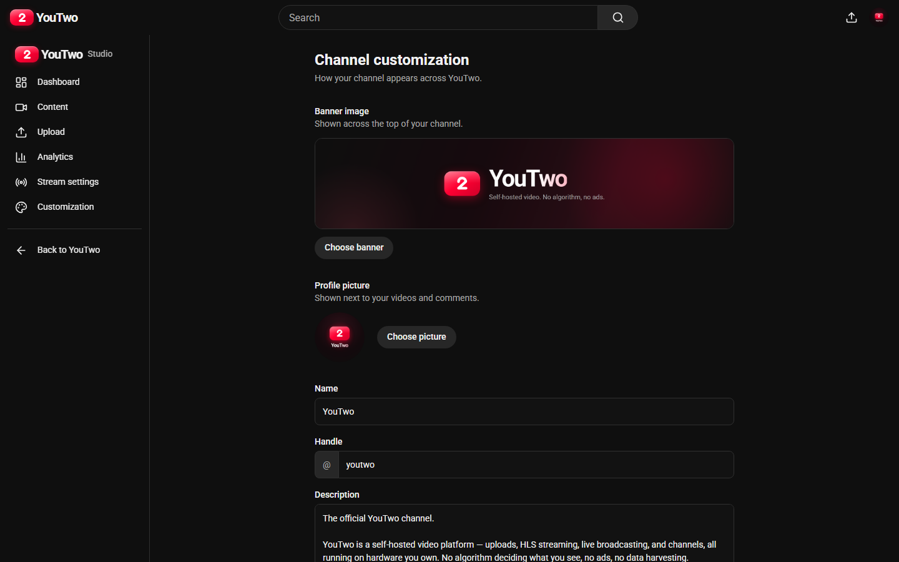 |
| **Admin** — grant and revoke verification | 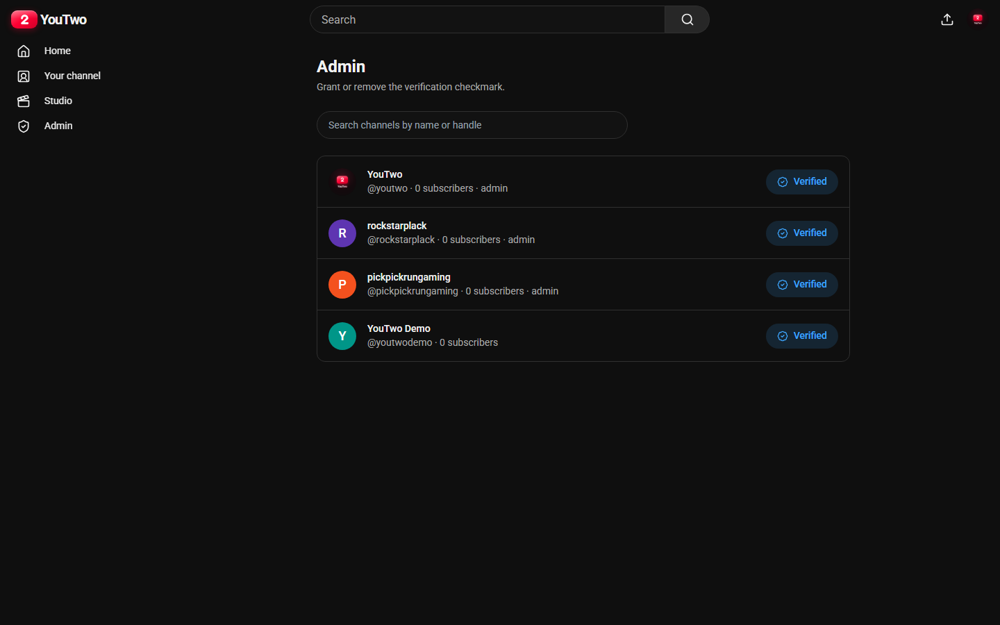 |

## Mobile web

| | | |
|---|---|---|
| 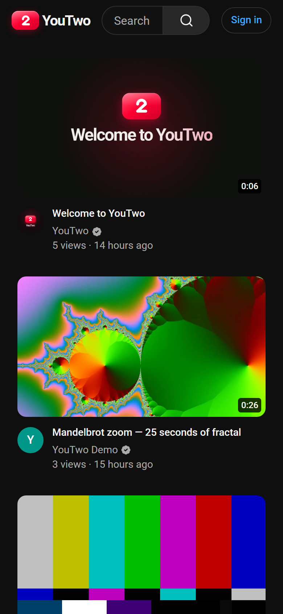 | 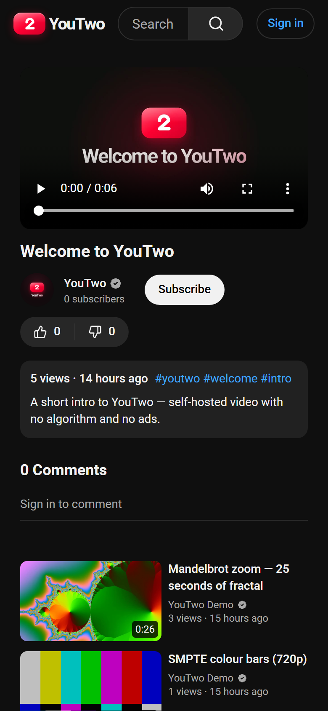 | 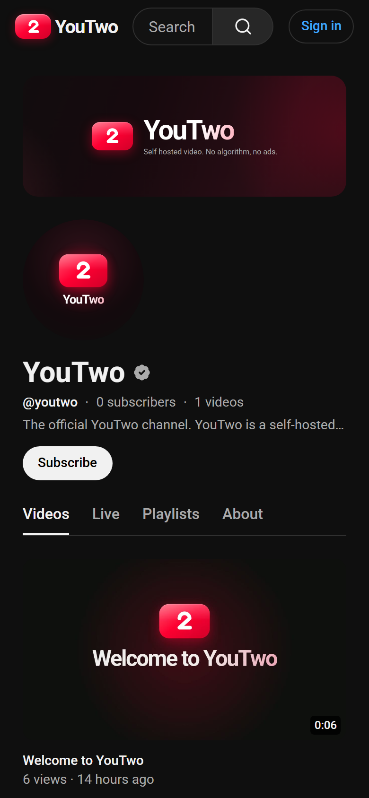 |

## Regenerating

```bash
# with the site running
PREVIEW_EMAIL=you@example.com PREVIEW_PASSWORD=... \
  node worker/capture-previews.mjs http://localhost:3000
```

The script signs in to capture the Studio and admin screens, and fails loudly
if the sign-in does not take, so a broken login can't quietly produce a folder
of identical login screenshots.
